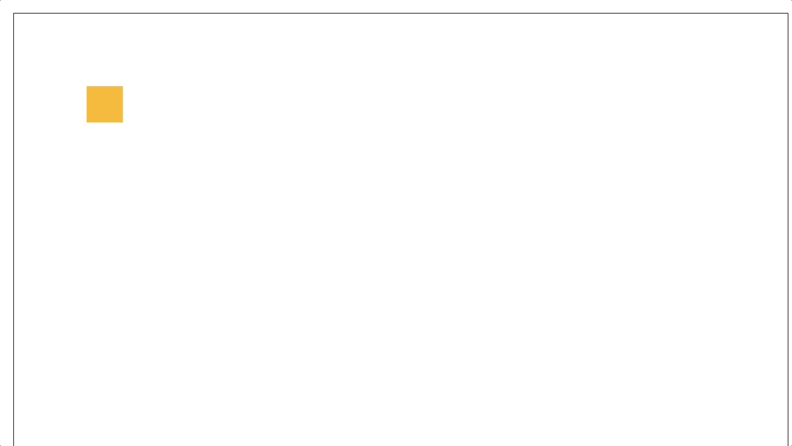
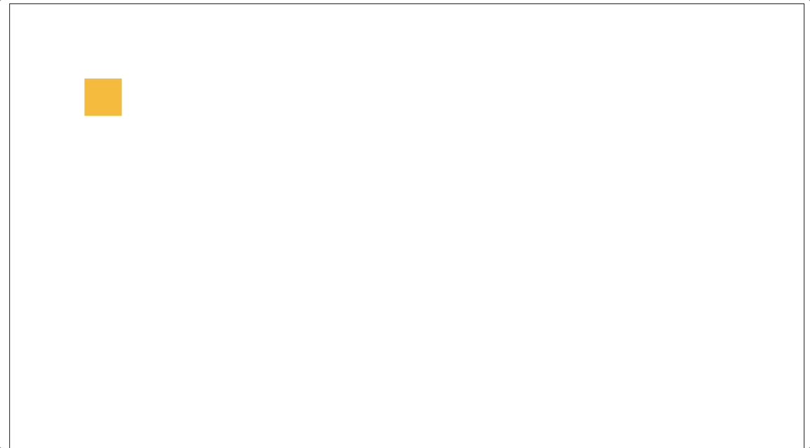

# 🎞️ Animation-Generator

본 리포지토리는 사내 애니메이션 툴에서 **복잡한 Promise 체인으로 인한 지연 및 타이밍 불일치 문제를 해결한 개선 사례**를 요약한 예시 코드입니다.

> ❗ 회사 내부 코드를 직접 공개할 수 없는 상황에서, 핵심 로직을 재현한 예제 코드를 통해 기술 역량을 보여주는 용도로 구성했습니다.

## 🤯 문제 상황

- move, scale, rotate가 하나의 이벤트로 연속으로 동작하는 애니메이션이 있을 때 move 동작 후 scale 동작 전에 0.5초 delay가 있고, scale 동작 후 rotate 동작 전에 1초 delay가 있는 모습 발견.
  

기존 코드는 다음과 같은 구조로 실행되었습니다:

- `Promise.all`과 `reduce`가 중첩되어 불필요한 대기 발생
- 각 애니메이션 그룹 실행 간 delay와 순서가 꼬이는 문제
- 중첩된 비동기 처리로 인해 실행 흐름 및 디버깅이 어려움

📄 [코드 보기](./src/bad.example.js)

## ✅ 개선 방향

### 1. **정밀 타이밍 제어**

- `requestAnimationFrame`과 `performance.now()`를 활용하여 실제 경과 시간 기반 제어

### 2. **단순화된 실행 구조**

- Promise 체인을 단순화하여 불필요한 대기 시간 제거
- 각 애니메이션의 delay를 requestAnimationFrame에서 처리

📄 [개선된 코드 보기](./src/example.js)

